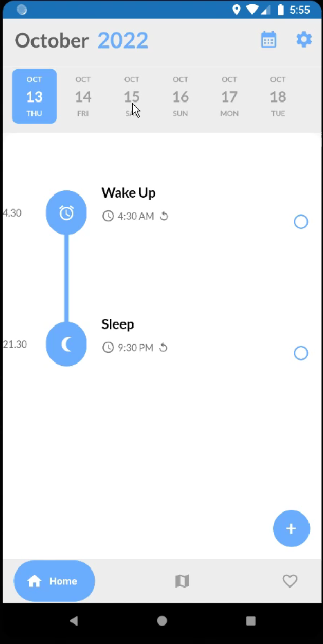
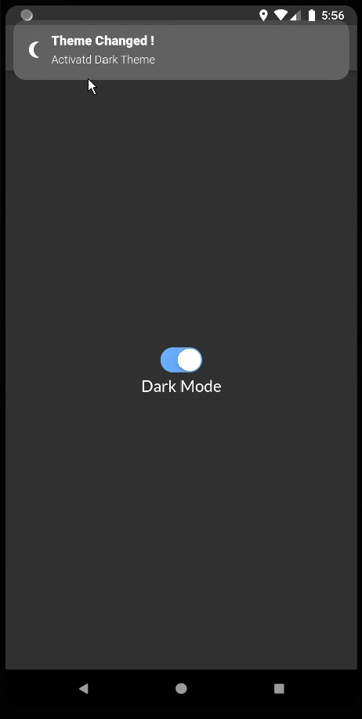

# ✅ To-do List Mobile Application – Task Management with Location & Notifications

This is a **Flutter-based To-do List Application** designed to boost productivity through structured planning, location tracking, and smart notifications. Built entirely by me from scratch, this app leverages **SQFLite** for local data storage and **Google Maps API** for real-time location-based task association.

---

## 🚀 Features

### 🗂️ Task Management
- Create tasks with title, description, start/end time, and date
- Update and delete tasks easily
- Mark tasks as completed

### 🗺️ Location Tracking
- Integrate Google Maps
- Attach specific locations to each task
- View all tasks plotted on an interactive map

### 🔔 Notification System
- Set wake-up and sleep times to customize reminder windows
- Receive timely notifications for scheduled tasks
- Tap notifications to view task details

### 🌓 Dark Mode
- Toggle dark mode from the settings page for a comfortable viewing experience

### 📆 Timeline View
- View tasks organized by date and time
- Visual timeline aligned with user-defined day schedule (wake/sleep)

---

## 📽️ Demo

### 🎬 Video Demo  

### 📄 Program Explanation  
[View PDF](https://drive.google.com/file/d/19ppzoYAn9_uYdgVcR7VLD1gA7secSyTn/view?usp=sharing)

---

## 📱 Screenshots & Flow

| Screen | Description | Preview |
|--------|-------------|---------|
| **Introduction Page** | Collects user’s wake-up and sleep times on first use |  |
| **Wake Up Time** | Allows scrollable input for wake-up reminders |  |
| **Sleep Time** | Same as above for sleep reminders |  |
| **Map Access** | Requests permission for location access |  |
| **Home Page** | Timeline view of the day; add tasks with ➕ button |  |
| **Add Task** | Create a new task with full detail inputs |  |
| **Add Location** | Assign a specific place using Google Maps |  |
| **Task Created** | Task appears on timeline |  |
| **Map View** | See all tasks pinned on Google Maps |  |
| **Update Task** | Click a task to edit or mark as done |  |
| **Completed Task** | Marked tasks show as completed |  |
| **Dark Mode** | Toggle theme in settings |  |
| **Set Notification** | Schedule task to test notification |  |
| **Receive Notification** | Appears in notification bar |  |
| **Task Detail from Notification** | Opens full task view |  |
| **Delete Task** | Remove completed or unnecessary tasks |  |

---

## 🛠️ Tech Stack

| Layer         | Technology            |
|---------------|------------------------|
| Framework     | Flutter (Dart)         |
| Database      | SQFLite                |
| Maps API      | Google Maps SDK        |
| State Management | `setState` (basic state) |
| Local Storage | Shared Preferences (for onboarding state) |
| Notifications | Local Notifications package |

---

## 👨‍💻 Developer Notes

I independently designed and implemented the app UI, backend logic, local storage, notification scheduler, and Google Maps integration. This project helped me strengthen my skills in **mobile development**, **state management**, and **user experience design**.

---

## 📬 Contact

If you'd like to collaborate, give feedback, or ask about the project, feel free to connect with me on [LinkedIn](https://www.linkedin.com/in/abdulmannansaipi/).

---

